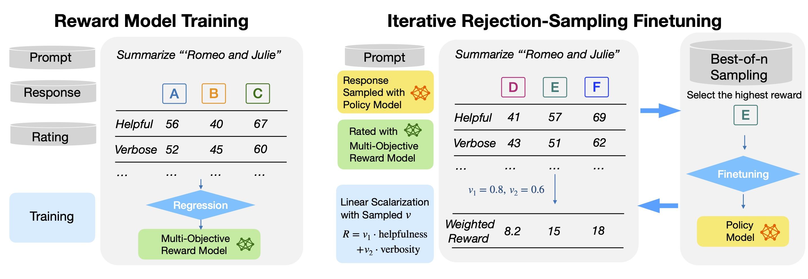

# Directional Preference Alignment

This is the repo for paper "**Arithmetic Control of LLMs for Diverse User Preferences: Directional Preference Alignment with Multi-Objective Rewards**" by Haoxiang Wang*, Yong Lin*, Wei Xiong*, Rui Yang, Shizhe Diao, Shuang Qiu, Han Zhao, Tong Zhang

**Code**: Will be released soon. Stay tuned! 

**Model**: [DPA-v1-Mistral-7B](https://huggingface.co/Haoxiang-Wang/DPA-v1-Mistral-7B/)

* Initialization: [SFT checkpoint](https://huggingface.co/HuggingFaceH4/mistral-7b-sft-beta)  of Mistral-7B trained on [UltraChat-200k](https://huggingface.co/datasets/HuggingFaceH4/ultrachat_200k)
* Training Dataset: [Ultra-Feedback](https://huggingface.co/datasets/openbmb/UltraFeedback) (same as [Zephyr-beta](https://huggingface.co/HuggingFaceH4/zephyr-7b-beta))

## Abstract
Fine-grained control over large language models (LLMs) remains a significant challenge, hindering their adaptability to diverse user needs. While Reinforcement Learning from Human Feedback (RLHF) shows promise in aligning LLMs, its reliance on scalar rewards often limits its ability to capture diverse user preferences in real-world applications. To address this limitation, we introduce the Directional Preference Alignment (DPA) framework. Unlike the scalar-reward RLHF, DPA incorporates multi-objective reward modeling to represent diverse preference profiles. Additionally, DPA models user preferences as directions (i.e., unit vectors) in the reward space to achieve user-dependent preference control. Our method involves training a multi-objective reward model and then fine-tuning the LLM with a preference-conditioned variant of Rejection Sampling Finetuning (RSF), an RLHF method adopted by Llama 2. This method enjoys a better performance trade-off across various reward objectives. In comparison with the scalar-reward RLHF, DPA offers users intuitive control over LLM generation: they can arithmetically specify their desired trade-offs (e.g., more helpfulness with less verbosity). We also validate the effectiveness of DPA with real-world alignment experiments on Mistral-7B. Our method provides straightforward arithmetic control over the trade-off between helpfulness and verbosity while maintaining competitive performance with strong baselines such as Direct Preference Optimization (DPO). 

## Arithmetic Control of LLMs

<!-- insert figures from assets/Chats_illustration.jpg with caption "Arithmetic Prompting"-->

**Arithmetic Prompting:** Specify desired tradeoff of different reward objectives (e.g., helpfulness and verbosity) with a unit vector, such as (1,0), (0.8, -0.6) or (0,1).

## Directional Preference Alignment

## Experiment Results

### Rewards on Validation Set

** Our method gives expanding empirical Pareto-front through the rejection-sampling iterations.

## AlpacaEval 2.0

** With different arithemtic prompts, our model can generate responses balancing helpfulness and verbosity. The performance is competitive with Zephyr-beta.